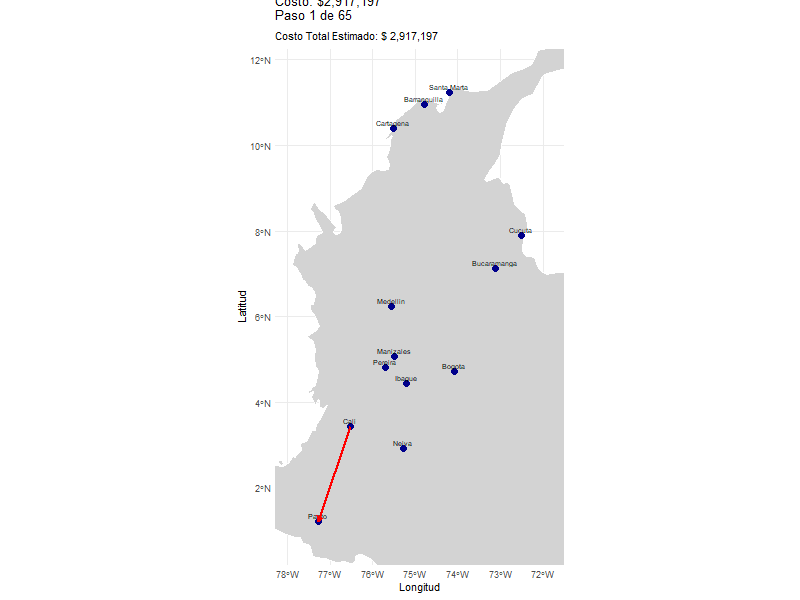

# Tabla de contenidos

1.  [Parte 1: Optimización Numérica](#parte-1-optimización-numérica)
    -   [Funciones de prueba](#funciones-de-prueba)
    -   [Optimización en dos y tres dimensiones](#optimización-en-dos-y-tres-dimensiones)
    -   [Métodos heurísticos vs Métodos de descenso por gradiente](#métodos-heurísticos-vs-métodos-de-descenso-por-gradiente)
    -   [Representación gráfica del proceso de optimización](#representación-gráfica-del-proceso-de-optimizacion)
2.  [Parte 2: Optimización Combinatoria](#parte-2-optimización-combinatoria)
    -   [Descripción del problema del vendedor](#descripción-del-problema-del-vendedor)
    -   [Algoritmos utilizados](#algoritmos-utilizados)
    -   [Representación gráfica de la mejor solución](#representación-gráfica-de-la-mejor-solución)
3.  [Reporte de Contribución Individual](#reporte-de-contribución-individual)
4.  [Bibliografía](#bibliografía) {#bibliografía}

# Parte 1: Optimización Numérica {#parte-1-optimización-numérica}

(Agregar contenido de la Parte 1 aquí)

------------------------------------------------------------------------

# Parte 2: Optimización Combinatoria {#parte-2-optimización-combinatoria}

En este ejercicio, se optimiza el recorrido de un vendedor que debe visitar 13 ciudades principales de Colombia (Bogota, Cali, Medellin, Barranquilla, Cartagena, Cucuta, Bucaramanga, Pereira, Santa Marta, Ibague, Pasto, Manizales, Neiva). El objetivo es encontrar la ruta más económica utilizando **colonias de hormigas** y **algoritmos genéticos**, tomando en cuenta los costos de desplazamiento, peajes y combustible.

## Descripción del problema del vendedor {#descripción-del-problema-del-vendedor}

Un vendedor debe hacer un recorrido por todas las 13 ciudades principales de Colombia. El costo de desplazamiento está determinado por tres factores:

-   **Costo del salario** : Para obtener el costo del salario se obtuvo el salario minimo en Colombia según el ministerio de trabajo fue de \$1.423.500, haciendo calculos simples llegamos a que la hora ordinaria en Colombia se da por la siguiente formula:

    $$
    \text{Valor hora ordinaria} = \frac{\text{salario mensual}}{\left(\frac{\text{horas semanales}}{6} \times 30\right)}
    $$

    Las horas semanales en Colombia a fecha de la realización de este trabajo es de 46, reemplazando en la ecuación:

    $$
    \text{Valor hora ordinaria} = \frac{$1.423.500}{\left(\frac{46}{6} \times 30\right)}
    $$

    Lo cual nos da un valor de hora ordinaria de \$6.189, el cual usaremos para el calculo del costo del salario.

    Adicionalmente necesitamos el tiempo de conducción entre ciudades para poder calcular el costo del salario. Para esto, se extrajó datos de la página de Mejores Rutas, que proporciona los tiempos de conducción entre las principales ciudades de Colombia. Se utilizó el promedio de los tiempos de conducción entre las 13 ciudades principales.

    El costo del salario se calcula con la siguiente ecuación (1):

    $\text{Costo_salario} = \text{tiempo} \times \text{costo_hora} \tag{1}$

-   **Costo del combustible** . Los datos sobre el costo del combustible fueron extraidos de la pagina de Comisión de Regulación de Energía y Gas (CREG), se hayó que el promedio de las 13 principales ciudidades de Colombia es de \$15.827.

    Además se seleccionó de manera arbitraria un Kia Picanto 1.0L, el cual tiene un consumo mixto de 60kms/galón; los datos de consumo fueron extraidos de "el carro colombiano", una revista virtual basada en automoviles.

    El costo del combustible se calcula con la siguiente ecuación (2):

    $$
    \text{Costo_gasolina} = \left( \frac{\text{Distancia}}{\text{Rendimiento (km/galon)}} \right) \times \text{Precio_por_galon} \tag{2}
    $$

    Observación: Se uso el galon como unidad de medida ya que en Colombia es el estandar para medir la gasolina.

-   **Costo de peajes**. El costo de los peajes se extrajo de la pagina de Tollguru, la cual proporciona información sobre los peajes entre las principales ciudades de Colombia. Se utilizó el promedio de los peajes entre las 13 ciudades principales.

    El costo de los peajes se calcula con la siguiente ecuación (3):

    $$
    \text{Costo_peaje} = \text{peaje} \tag{3}
    $$

La suma de todos estos costos nos da el costo total de desplazamiento entre dos ciudades, que se calcula con la siguiente ecuación (4): $$
\text{Costo_total} = \text{Costo_salario} + \text{Costo_gasolina} + \text{Costo_peaje} \tag{4}
$$ Este problema se modela como un **Problema del Viajante de Comercio** (TSP, por sus siglas en inglés), en el cual buscamos la ruta más corta o económica para visitar todas las ciudades.

## Algoritmos utilizados {#algoritmos-utilizados}

En este caso, se usan dos algoritmos de optimización para encontrar la mejor ruta:

1\. **Algoritmo de Colonias de Hormigas (ACO)**: Simula el comportamiento de las hormigas para encontrar la mejor ruta por medio de la deposición de feromonas en el camino.

2\. **Algoritmo Genético (GA)**: Utiliza operadores genéticos como selección, cruce y mutación para encontrar soluciones óptimas en un espacio de búsqueda complejo.

### Código en R para la optimización

Cargamos las librerias necesarias:

```{r}
library(ggplot2)
library(dplyr)
library(sf)
library(rnaturalearth)
library(rnaturalearthdata)
library(gganimate)
library(gifski)
library(GA)
```

Cargamos los csv CSV con las distancias viales entre las ciudades y peajes.

```{r}
df_distancias
#df_peajes
#crear df_peajes a partir de df_distancias entre más alto sea la distnacia más será el peaje
df_peajes <- df_distancias * 350
df_peajes
ciudades_nombres <- c("Bogota", "Cali", "Medellin", "Barranquilla", "Cartagena", 
                      "Cucuta", "Bucaramanga", "Pereira", "Santa Marta", "Ibague", 
                      "Pasto", "Manizales", "Neiva")
n_ciudades <- length(ciudades_nombres)
```

Definimos parámetros de costos iniciales:

```{r}
salario_hora <- 6189  # COP/hora
consumo_combustible <- 60  # km/galón
precio_gasolina <- 15827  # COP/galón
```

Calculamos las variables compuestas (costo salario, costo gasolina):

```{r}
df_costo_gasolina <- (df_distancias/consumo_combustible) * precio_gasolina
df_tiempos_viajes <- df_distancias/43
df_costo_salario <- df_tiempos_viajes * salario_hora
```

Ahora calculamos el costo total de desplazamiento entre las ciudades:

```{r}
df_costos_total <- df_costo_gasolina + df_costo_salario + df_peajes
df_costos_total
#exportar dtf_costo_total a csv, verificando que no exista el archivo
if (file.exists("df_costos_total.csv")) {
  file.remove("df_costos_total.csv")
  write.csv(df_costo_total, "df_costos_total.csv")
} else {
  write.csv(df_costo_total, "df_costos_total.csv")
}
```

Ahora, dado este dataset de costos, utilizaremos tanto el algoritmo de colonia de hormigas y un algoritmo evolutivo para encontrar el orden correcto.

## Algoritmo de colonia de hormigas:

"En ciencias de la computación y en investigación operativa, el algoritmo de la colonia de hormigas, algoritmo hormiga u optimización por colonia de hormigas (Ant Colony Optimization, ACO) es una técnica probabilística para solucionar problemas computacionales que pueden reducirse a buscar los mejores caminos o rutas en grafos." (Wikipedia, s.f.).

Este algoritmo se basa en el comportamiento de las hormigas al buscar comida. Las hormigas depositan feromonas en el camino que recorren, y la cantidad de feromonas depositadas depende de la calidad de la ruta. Las hormigas son más propensas a seguir caminos con mayor concentración de feromonas, lo que les permite encontrar rutas óptimas a lo largo del tiempo.

Ahora construimos la función para el algoritmo de colonia de hormigas:

```{r}
library(stats)


ant_colony_optimization_r <- function(costos, num_ants = 10, num_iterations = 100, alpha = 1.0, beta = 2.0, rho = 0.5, Q = 100, verbose = TRUE) {
  
  cost_matrix <- as.matrix(costos)
  n_nodes <- ncol(cost_matrix)
  
  if (nrow(cost_matrix) != n_nodes) {
    stop("La matriz de costos debe ser cuadrada.")
  }
  
  # Usar cost_matrix directamente como 'distancia' para la heurística
  # No usar dist_matrix = cost_matrix ya que la heurística debe basarse en el costo
  # Hacer la diagonal Inf para evitar elegir la misma ciudad
  visibility_matrix <- cost_matrix
  diag(visibility_matrix) <- Inf
  
  # eta (visibilidad heurística) es 1/costo. Costos más bajos son más atractivos.
  eta <- 1 / visibility_matrix 
  eta[is.infinite(eta)] <- 0 # Limpiar Inf si hubo costos de 0 (improbable fuera de diagonal)
  eta[visibility_matrix == 0] <- 0 # Asegurar que 1/0 no sea Infinito
  
  # Inicializar matriz de feromonas
  # Evitar dividir por cero si la media de costos es cero o infinita
  mean_cost <- mean(cost_matrix[cost_matrix > 0 & !is.infinite(cost_matrix)])
  if (is.na(mean_cost) || mean_cost <= 0 || !is.finite(mean_cost)) {
      initial_pheromone <- 1.0 # Valor por defecto si la media no es útil
  } else {
      initial_pheromone <- 1 / (n_nodes * mean_cost)
  }
  pheromone_matrix <- matrix(initial_pheromone, nrow = n_nodes, ncol = n_nodes)
  diag(pheromone_matrix) <- 0
  
  best_tour <- NULL
  best_length <- Inf
  
  history_best_length <- numeric(num_iterations) # Para seguir la convergencia
  
  for (iter in 1:num_iterations) {
    
    all_tours <- vector("list", num_ants)
    all_lengths <- numeric(num_ants)
    
    for (ant in 1:num_ants) {
      
      current_tour <- numeric(n_nodes)
      visited <- logical(n_nodes)
      
      # Empezar en un nodo aleatorio
      start_node <- sample(1:n_nodes, 1)
      current_tour[1] <- start_node
      visited[start_node] <- TRUE
      current_node <- start_node
      
      for (step in 2:n_nodes) {
        possible_nodes <- which(!visited)
        
        if (length(possible_nodes) == 0) break # Si no quedan nodos (no debería pasar en TSP completo)
        
        pheromones_to_possible <- pheromone_matrix[current_node, possible_nodes]
        eta_to_possible <- eta[current_node, possible_nodes]
        
        # Asegurar que los componentes de probabilidad sean numéricos finitos
        pheromones_to_possible[!is.finite(pheromones_to_possible)] <- 1e-10
        eta_to_possible[!is.finite(eta_to_possible)] <- 1e-10
         pheromones_to_possible[pheromones_to_possible < 1e-10] <- 1e-10 # Evitar valores muy pequeños
         eta_to_possible[eta_to_possible < 1e-10] <- 1e-10

        prob_numerator <- (pheromones_to_possible^alpha) * (eta_to_possible^beta)
        
        sum_prob <- sum(prob_numerator)
        
        probabilities <- numeric(length(possible_nodes))
        if (sum_prob > 1e-10 && is.finite(sum_prob)) {
           probabilities <- prob_numerator / sum_prob
        } else {
           # Si la suma es cero o infinita, asignar probabilidades iguales
           probabilities <- rep(1/length(possible_nodes), length(possible_nodes))
        }
        
        # Asegurar que las probabilidades sumen 1 y no sean NA/Inf
         if(any(!is.finite(probabilities)) || sum(probabilities) < 1e-10) {
           probabilities <- rep(1/length(possible_nodes), length(possible_nodes))
         }
         probabilities <- probabilities / sum(probabilities) # Normalizar por si acaso

        # Elegir el siguiente nodo basado en las probabilidades
         if (length(possible_nodes) == 1) {
             chosen_index <- 1
         } else {
            chosen_index <- sample(1:length(possible_nodes), 1, prob = probabilities)
         }
        next_node <- possible_nodes[chosen_index]
        
        current_tour[step] <- next_node
        visited[next_node] <- TRUE
        current_node <- next_node
      }
      
      # Calcular longitud del tour (incluyendo regreso al inicio)
      current_length <- 0
      for (i in 1:(n_nodes - 1)) {
          # Añadir validación para índices
          from_node <- current_tour[i]
          to_node <- current_tour[i+1]
          if (is.na(from_node) || is.na(to_node) || from_node < 1 || from_node > n_nodes || to_node < 1 || to_node > n_nodes) {
              warning(paste("Índice inválido en tour de hormiga", ant, "iteración", iter))
              current_length <- Inf # Penalizar tour inválido
              break
          }
          cost_segment <- cost_matrix[from_node, to_node]
          if (!is.finite(cost_segment)) cost_segment <- Inf
          current_length <- current_length + cost_segment
      }
      # Costo de volver al inicio
       if(is.finite(current_length)) {
           from_node <- current_tour[n_nodes]
           to_node <- current_tour[1]
           if (is.na(from_node) || is.na(to_node) || from_node < 1 || from_node > n_nodes || to_node < 1 || to_node > n_nodes) {
              warning(paste("Índice inválido en cierre de tour de hormiga", ant, "iteración", iter))
              current_length <- Inf
           } else {
                cost_segment <- cost_matrix[from_node, to_node]
                 if (!is.finite(cost_segment)) cost_segment <- Inf
                 current_length <- current_length + cost_segment
           }
       }


      all_tours[[ant]] <- current_tour
      all_lengths[ant] <- current_length
      
      # Actualizar el mejor tour global si se encuentra uno mejor
      if (is.finite(current_length) && current_length < best_length) {
         if (verbose) {
           if (is.finite(best_length)) {
             cat(sprintf("Iter %d, Hormiga %d: Nueva mejor longitud = %.2f (anterior = %.2f)\n", iter, ant, current_length, best_length))
           } else {
             cat(sprintf("Iter %d, Hormiga %d: Primera longitud encontrada = %.2f\n", iter, ant, current_length))
           }
         }
        best_length <- current_length
        best_tour <- current_tour
      }
    }
    
    # Evaporación de feromonas
    pheromone_matrix <- (1 - rho) * pheromone_matrix
    
    # Deposición de feromonas
    delta_pheromone <- matrix(0, nrow = n_nodes, ncol = n_nodes)
    for (ant in 1:num_ants) {
      ant_tour <- all_tours[[ant]]
      ant_length <- all_lengths[ant]
      
      # Solo depositar si el tour es válido y finito
      if (length(ant_tour) == n_nodes && all(ant_tour > 0) && is.finite(ant_length) && ant_length > 0) {
          deposit_amount <- Q / ant_length
          
          for (i in 1:(n_nodes - 1)) {
            node1 <- ant_tour[i]
            node2 <- ant_tour[i+1]
            delta_pheromone[node1, node2] <- delta_pheromone[node1, node2] + deposit_amount
            delta_pheromone[node2, node1] <- delta_pheromone[node2, node1] + deposit_amount # Asumiendo simetría
          }
          # Depositar en el arco de cierre
          node1 <- ant_tour[n_nodes]
          node2 <- ant_tour[1]
          delta_pheromone[node1, node2] <- delta_pheromone[node1, node2] + deposit_amount
          delta_pheromone[node2, node1] <- delta_pheromone[node2, node1] + deposit_amount
      }
    }
    
    pheromone_matrix <- pheromone_matrix + delta_pheromone
    # Evitar que la feromona sea exactamente cero o negativa
    pheromone_matrix[pheromone_matrix < 1e-10] <- 1e-10 
    diag(pheromone_matrix) <- 0 # Diagonal siempre cero
    
    history_best_length[iter] <- best_length # Guardar la mejor longitud de esta iteración
    
  } # Fin bucle iteraciones
  
  if (verbose && is.infinite(best_length)){
     cat("ACO: No se encontró ninguna ruta válida finita.\n")
  } else if (verbose) {
      cat(sprintf("ACO: Optimización finalizada. Mejor longitud encontrada = %.2f\n", best_length))
  }
  
  return(list(best_tour_indices = best_tour, 
              best_tour_cost = best_length,
              best_tour_cities = ciudades_nombres[best_tour],
              convergence = history_best_length))
}

# Ejecutar ACO
resultado_aco <- ant_colony_optimization_r(
  costos = df_costo_total, 
  num_ants = 20,           # Aumentar número de hormigas puede ayudar
  num_iterations = 150,   # Más iteraciones
  alpha = 1.0,            # Importancia de la feromona
  beta = 3.0,             # Importancia de la visibilidad (costo inverso) - Aumentado
  rho = 0.3,              # Tasa de evaporación (más baja = más memoria)
  Q = 100,                # Cantidad de feromona depositada
  verbose = TRUE
)

print("Resultado ACO:")
print(paste("Mejor costo encontrado:", format(resultado_aco$best_tour_cost, scientific = FALSE, big.mark=",")))
print(paste("Mejor ruta (ciudades):", paste(resultado_aco$best_tour_cities, collapse = " -> ")))

```

Continuamos con el **Algoritmo Genetico**:

"Los algoritmos genéticos (AG) funcionan entre el conjunto de soluciones de un problema llamado fenotipo, y el conjunto de individuos de una población natural, codificando la información de cada solución en una cadena, generalmente binaria, llamada cromosoma. Los símbolos que forman la cadena son llamados genes. Cuando la representación de los cromosomas se hace con cadenas de dígitos binarios se le conoce como genotipo. Los cromosomas evolucionan a través de iteraciones, llamadas generaciones. En cada generación, los cromosomas son evaluados usando alguna medida de aptitud. Las siguientes generaciones (nuevos cromosomas), son generadas aplicando los operadores genéticos repetidamente, siendo estos los operadores de selección, cruzamiento, mutación y reemplazo." (Wikipedia, s.f.).

Ahora construimos la función para el algoritmo genético:

```{r}
# Función para calcular el costo total de un tour (permutación de índices)
calculate_tour_cost <- function(tour, cost_matrix) {
  total_cost <- 0
  n <- length(tour)
  for (i in 1:(n - 1)) {
    cost <- cost_matrix[tour[i], tour[i+1]]
    if (!is.finite(cost)) return(Inf) # Penalizar rutas inválidas/infinitas
    total_cost <- total_cost + cost
  }
  # Añadir costo de volver al inicio
  cost_return <- cost_matrix[tour[n], tour[1]]
   if (!is.finite(cost_return)) return(Inf)
  total_cost <- total_cost + cost_return
  return(total_cost)
}

# Función de fitness para GA (negativo del costo, porque ga maximiza)
fitness_function <- function(tour, cost_matrix) {
  cost <- calculate_tour_cost(tour, cost_matrix)
  return(-cost) # Retornar negativo del costo
}

# Ejecutar GA
# Usamos type = "permutation" para TSP
set.seed(456) # Para reproducibilidad
resultado_ga <- ga(
  type = "permutation",
  fitness = fitness_function, # Nuestra función de fitness
  cost_matrix = df_costos_total, # Argumento adicional para la func. fitness
  lower = 1,                # Índice mínimo de ciudad
  upper = n_ciudades,         # Índice máximo de ciudad
  popSize = 100,             # Tamaño de la población (más grande puede ser mejor)
  maxiter = 200,            # Número de generaciones
  run = 100,                # Detener si no hay mejora en 'run' generaciones
  pmutation = 0.2,          # Probabilidad de mutación
  pcrossover = 0.8,         # Probabilidad de cruce
  elitism = max(1, floor(0.1 * 100)), # Mantener el 10% de los mejores
  monitor = gaMonitor,      # Mostrar progreso
  seed = 123                # Semilla para reproducibilidad interna de ga
)

# Extraer resultados del GA
# Acceder directamente a los slots del objeto resultado_ga usando @

# Seleccionar la primera fila de soluciones si hay varias
best_tour_indices_ga <- resultado_ga@solution[1,] 

# Acceder al valor de fitness directamente y luego aplicar el negativo
best_tour_cost_ga <- -resultado_ga@fitnessValue 

# Obtener los nombres de las ciudades para la ruta seleccionada
best_tour_cities_ga <- ciudades_nombres[best_tour_indices_ga]

# Imprimir para verificar
print(paste("Mejor costo GA:", format(best_tour_cost_ga, scientific = FALSE, big.mark=",")))
print(paste("Mejor ruta GA (índices):", paste(best_tour_indices_ga, collapse = " -> ")))
print(paste("Mejor ruta GA (ciudades):", paste(best_tour_cities_ga, collapse = " -> ")))

# Graficar convergencia del GA 
# Esto debería funcionar ahora que resultado_ga es válido
plot(resultado_ga)
```

Comparando ambos algoritmos obtenemos que:

```{r}
# --- Comparación de Resultados ACO vs GA ---

print("--- Comparación Final ---")

# Asignar los resultados de ACO a variables consistentes si existen y son finitos
costo_aco <- if (!is.null(resultado_aco) && is.finite(resultado_aco$best_tour_cost)) resultado_aco$best_tour_cost else Inf
indices_aco <- if (!is.null(resultado_aco) && is.finite(resultado_aco$best_tour_cost)) resultado_aco$best_tour_indices else NULL

# Asignar los resultados de GA a variables consistentes si existen y son finitos
costo_ga <- if (exists("best_tour_cost_ga") && is.finite(best_tour_cost_ga)) best_tour_cost_ga else Inf
indices_ga <- if (exists("best_tour_indices_ga") && is.finite(best_tour_cost_ga)) best_tour_indices_ga else NULL

# Verificar si se obtuvieron resultados válidos
if (is.infinite(costo_aco) && is.infinite(costo_ga)) {
  print("Error: Ninguno de los algoritmos encontró una solución válida.")
  final_best_cost <- Inf
  final_best_tour_indices <- NULL
  algoritmo_ganador <- "Ninguno"
} else {
  # Comparar los costos
  if (costo_ga < costo_aco) {
    algoritmo_ganador <- "Algoritmo Genético (GA)"
    final_best_cost <- costo_ga
    final_best_tour_indices <- indices_ga
    print(paste("GA encontró una mejor solución (Costo:", format(final_best_cost, scientific = FALSE, big.mark=","), ")"))
    print(paste("  (Costo ACO:", format(costo_aco, scientific = FALSE, big.mark=","), ")"))
  } else if (costo_aco < costo_ga) {
    algoritmo_ganador <- "Colonia de Hormigas (ACO)"
    final_best_cost <- costo_aco
    final_best_tour_indices <- indices_aco
    print(paste("ACO encontró una mejor solución (Costo:", format(final_best_cost, scientific = FALSE, big.mark=","), ")"))
    print(paste("  (Costo GA:", format(costo_ga, scientific = FALSE, big.mark=","), ")"))
  } else { # Costos iguales
    algoritmo_ganador <- "Ambos (costo igual)"
    final_best_cost <- costo_ga # O costo_aco, son iguales
    # Podemos elegir arbitrariamente GA en caso de empate, o mantener ambas si quisiéramos
    final_best_tour_indices <- indices_ga 
    print(paste("Ambos algoritmos encontraron soluciones con el mismo costo:", format(final_best_cost, scientific = FALSE, big.mark=",")))
  }
  
  # Imprimir la mejor ruta encontrada
  if (!is.null(final_best_tour_indices)) {
      final_best_tour_cities <- ciudades_nombres[final_best_tour_indices]
      print(paste("Mejor ruta encontrada por", algoritmo_ganador, ":"))
      print(paste(final_best_tour_cities, collapse = " -> "))
  }
}
```

Graficando el mejor recorrido obtenemos que:

```{r}
# Coordenadas aproximadas de las ciudades (¡Verificar y ajustar si es necesario!)
coords <- data.frame(
  ciudad = ciudades_nombres,
  lon = c(-74.0721, -76.5225, -75.5736, -74.7964, -75.5144, -72.5074, -73.1198, -75.6961, -74.2050, -75.2174, -77.2811, -75.4849, -75.2819),
  lat = c(4.7110, 3.4372, 6.2442, 10.9639, 10.3910, 7.8939, 7.1139, 4.8133, 11.2404, 4.4389, 1.2136, 5.0689, 2.9273)
)

# Seleccionar la mejor ruta (índices) - Usaremos la de GA aquí
# Si ACO fue mejor, usar: best_tour_indices <- resultado_aco$best_tour_indices
if (!is.null(resultado_ga) && is.finite(best_tour_cost_ga) && 
    (!is.finite(resultado_aco$best_tour_cost) || best_tour_cost_ga < resultado_aco$best_tour_cost)) {
  print("Usando la ruta del GA para la visualización.")
  best_tour_indices <- best_tour_indices_ga
  best_cost <- best_tour_cost_ga
} else if (!is.null(resultado_aco) && is.finite(resultado_aco$best_tour_cost)) {
   print("Usando la ruta del ACO para la visualización.")
   best_tour_indices <- resultado_aco$best_tour_indices
   best_cost <- resultado_aco$best_tour_cost
} else {
   stop("No se encontró una ruta válida por ninguno de los métodos.")
}


# Crear dataframe con la secuencia de la ruta para graficar segmentos
ruta_ordenada <- coords[best_tour_indices, ]
# Añadir el punto de inicio al final para cerrar el ciclo
ruta_ordenada <- rbind(ruta_ordenada, ruta_ordenada[1, ])
ruta_ordenada$orden <- 1:nrow(ruta_ordenada) # Para animación

# Crear segmentos de línea para el gráfico
segmentos_ruta <- data.frame(
  lon_inicio = head(ruta_ordenada$lon, -1),
  lat_inicio = head(ruta_ordenada$lat, -1),
  lon_fin = tail(ruta_ordenada$lon, -1),
  lat_fin = tail(ruta_ordenada$lat, -1),
  paso = 1:(nrow(ruta_ordenada) - 1) # Paso de animación
)

# Obtener mapa de Colombia
colombia <- ne_countries(scale = "medium", country = "Colombia", returnclass = "sf")

# Crear el gráfico estático base
mapa_base <- ggplot() +
  geom_sf(data = colombia, fill = "lightgrey", color = "white") +
  geom_point(data = coords, aes(x = lon, y = lat), color = "darkblue", size = 3) +
  geom_text(data = coords, aes(x = lon, y = lat, label = ciudad), vjust = -0.5, size = 2.5) +
  labs(title = "Ruta Óptima del Vendedor en Colombia",
       subtitle = paste("Costo Total Estimado: $", format(best_cost, big.mark=",", scientific = FALSE)),
       x = "Longitud", y = "Latitud") +
  theme_minimal() +
   coord_sf(xlim = range(coords$lon) + c(-1, 1), ylim = range(coords$lat) + c(-1, 1), expand = FALSE) # Ajustar zoom

# Añadir segmentos de la ruta al gráfico base
mapa_con_ruta <- mapa_base +
  geom_segment(data = segmentos_ruta,
               aes(x = lon_inicio, y = lat_inicio, xend = lon_fin, yend = lat_fin),
               color = "red", size = 1, arrow = arrow(length = unit(0.2, "cm")))

print(mapa_con_ruta) # Mostrar mapa estático final

# Crear la animación
animacion_ruta <- mapa_base +
  geom_segment(data = segmentos_ruta,
               aes(x = lon_inicio, y = lat_inicio, xend = lon_fin, yend = lat_fin),
               color = "red", size = 1, arrow = arrow(length = unit(0.2, "cm"))) +
  transition_reveal(paso) + # Animar mostrando los segmentos paso a paso
  ease_aes('linear') + # Movimiento constante
   ggtitle('Ruta Óptima del Vendedor (Animada)\nCosto: ${format(best_cost, big.mark=",", scientific = FALSE)}\nPaso {frame} de {nframes}') # Título dinámico

# Renderizar y guardar la animación como GIF
# Ajustar nframes y fps según se desee
num_pasos <- nrow(segmentos_ruta)
anim_render <- animate(animacion_ruta, nframes = num_pasos * 5, fps = 5, # Más frames para cámara lenta
                       width = 800, height = 600, renderer = gifski_renderer())

anim_save("ruta_optima_animada.gif", animation = anim_render)

print("Animación guardada como ruta_optima_animada.gif")
```

Mostramos el gif:

```{r}
# Mostrar el GIF en el documento

```

# Bibliografía {#bibliografía}

La información sobre las distancias viales entre ciudades y tiempos de conducción fue obtenida de: Mejores Rutas. (n.d.). *Tabla de distancias entre ciudades de Colombia*. Recuperado el 25 de abril de 2025, de <https://colombia.mejoresrutas.com/tabla-de-distancias/co/#google_vignette>

Información sobre el salario mínimo: Ministerio de Trabajo. (2025). *Presidente decreto salario mínimo para 2025 quedó en 1.623.500, incluido auxilio de transporte*. Recuperado el 25 de abril de 2025, de <https://www.mintrabajo.gov.co/presidente-decreto-salario-minimo-para-2025-quedo-en-1.623.500-incluido-auxilio-de-transporte>

Información sobre el costo de combustible : Comisión de Regulación de Energía y Gas (CREG). (2025). *Informe sobre precios de combustibles en Colombia*. Recuperado el 25 de abril de 2025, de <https://creg.gov.co/publicaciones/15565/precios-de-combustibles-liquidos/>

Información sobre el consumo de combustible: El Carro Colombiano. (2025). *Kia Picanto 2025: características y precios*. Recuperado el 25 de abril de 2025, de <https://www.elcarrocolombiano.com/pruebas/kia-picanto-1-0l-vs-kia-picanto-1-25l-automatico-2018/>

Wikipedia. (s.f.). *Algoritmo de la colonia de hormigas*. *Wikipedia, La enciclopedia libre*. Recuperado el 28 de abril de 2025, de <https://es.wikipedia.org/wiki/Algoritmo_de_la_colonia_de_hormigas>

Wikipedia. (s.f.). *Algoritmo genético*. *Wikipedia, La enciclopedia libre*. Recuperado el 28 de abril de 2025, de <https://es.wikipedia.org/wiki/Algoritmo_gen%C3%A9tico>

# Reporte de Contribución Individual {#reporte-de-contribución-individual}
