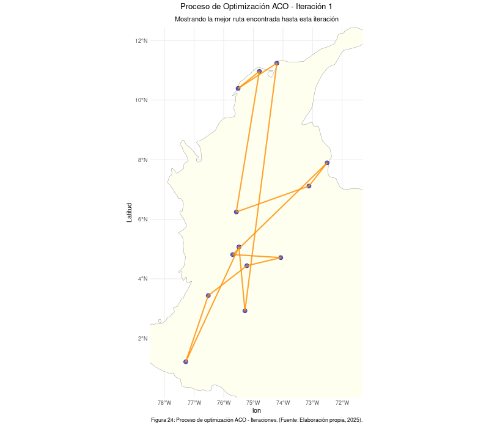

# Tabla de contenidos

1.  [Parte 1: Optimización Numérica](#parte-1-optimización-numérica)
    -   [Funciones de prueba](#funciones-de-prueba)
    -   [Optimización en dos y tres dimensiones](#optimización-en-dos-y-tres-dimensiones)
    -   [Métodos heurísticos vs Métodos de descenso por gradiente](#métodos-heurísticos-vs-métodos-de-descenso-por-gradiente)
    -   [Representación gráfica del proceso de optimización](#representación-gráfica-del-proceso-de-optimizacion)
2.  [Parte 2: Optimización Combinatoria](#parte-2-optimización-combinatoria)
    -   [Descripción del problema del vendedor](#descripción-del-problema-del-vendedor)
    -   [Algoritmos utilizados](#algoritmos-utilizados)
    -   [Representación gráfica de la mejor solución](#representación-gráfica-de-la-mejor-solución)
3.  [Reporte de Contribución Individual](#reporte-de-contribución-individual)
4.  [Bibliografía](#bibliografía) {#bibliografía}

# Parte 1: Optimización Numérica {#parte-1-optimización-numérica}

(Agregar contenido de la Parte 1 aquí)

------------------------------------------------------------------------

# Parte 2: Optimización Combinatoria {#parte-2-optimización-combinatoria}

En esta sección, se aborda la optimización del recorrido de un vendedor que debe visitar 13 ciudades principales de Colombia: Bogotá, Cali, Medellín, Barranquilla, Cartagena, Cúcuta, Bucaramanga, Pereira, Santa Marta, Ibagué, Pasto, Manizales y Neiva. El objetivo central es determinar la ruta que minimice el costo total del viaje, empleando dos metaheurísticas: Optimización por **Colonias de Hormigas (ACO)** y **Algoritmos Genéticos (GA)**. El costo total considera factores como el salario del conductor durante el viaje, el consumo de combustible, las distancias, tiempos de viaje y peajes.

## Descripción del problema del vendedor {#descripción-del-problema-del-vendedor}

El problema se modela como una instancia del Problema del Viajante de Comercio (TSP), un clásico desafío de optimización combinatoria. Se busca encontrar la ruta cíclica más económica que visite cada una de las 13 ciudades exactamente una vez y regrese a la ciudad de origen. El costo asociado al desplazamiento entre cualquier par de ciudades se desglosa en tres componentes principales:

-   **Costo del salario** : Se tomó como referencia el salario mínimo mensual legal vigente (SMMLV) en Colombia al momento del estudio, fijado en \$1,423,500 COP (fuente: Ministerio de Trabajo). Haciendo calculos simples llegamos a que la hora ordinaria en Colombia se da por la siguiente formula:

    $$
    \text{Valor hora ordinaria} = \frac{\text{salario mensual}}{\left(\frac{\text{horas semanales}}{6} \times 30\right)}
    $$

    Las horas semanales en Colombia a fecha de la realización de este trabajo es de 46, reemplazando en la ecuación:

    $$
    \text{Valor hora ordinaria} = \frac{$1.423.500}{\left(\frac{46}{6} \times 30\right)}
    $$

    Lo cual nos da un valor de hora ordinaria de \$6.189, el cual usaremos para el calculo del costo del salario.

    Adicionalmente necesitamos el tiempo de conducción entre ciudades para poder calcular el costo del salario. Para esto, se consultaron en [Google Maps Distance Matrix API](https://developers.google.com/maps/documentation/distance-matrix){target="_blank"} utilizando el modo *dirving*.

    El costo del salario se calcula con la siguiente ecuación (1):

    $\text{Costo_salario} = \text{tiempo} \times \text{costo_hora} \tag{1}$

-   **Costo del combustible** . Se utilizó un precio promedio del galón de gasolina, obtenido a partir de los precios reportados por la Comisión de Regulación de Energía y Gas (CREG) para las 13 ciudades principales en la fecha del análisis, resultando en \$15,827 COP/galón.

    Se seleccionó como vehículo de referencia un Kia Picanto 1.0L. Según datos de la publicación especializada "El Carro Colombiano", este vehículo presenta un consumo mixto aproximado de 60 km/galón.

    Además necesitamos la distancia entre las ciudades, la cual fue obtenida de la misma API de Google Maps. La distancia entre las ciudades se obtiene en kilómetros y se usa para calcular el costo del combustible.

    El costo del combustible se calcula con la siguiente ecuación (2):

    $$
    \text{Costo_gasolina} = \left( \frac{\text{Distancia}}{\text{Rendimiento (km/galon)}} \right) \times \text{Precio_por_galon} \tag{2}
    $$

    Observación: Se uso el galon como unidad de medida ya que en Colombia es el estandar para medir la gasolina.

-   **Costo de peajes**. La información sobre los costos de peajes para las rutas que conectan las 13 ciudades se obtuvo de la plataforma Tollguru (Se consideraron los peajes de las rutas más comunes).

    El costo de los peajes se calcula con la siguiente ecuación (3):

    $$
    \text{Costo_peaje} = \text{peaje} \tag{3}
    $$

La suma de todos estos costos nos da el costo total de desplazamiento entre dos ciudades, que se calcula con la siguiente ecuación (4): $$
\text{Costo_total} = \text{Costo_salario} + \text{Costo_gasolina} + \text{Costo_peaje} \tag{4}
$$ Este problema se modela como un **Problema del Viajante de Comercio** (TSP, por sus siglas en inglés), en el cual buscamos la ruta más corta o económica para visitar todas las ciudades.

## Algoritmos utilizados {#algoritmos-utilizados}

En este caso, se usan dos algoritmos de optimización para encontrar la mejor ruta:

1\. **Algoritmo de Colonias de Hormigas (ACO)**: Este algoritmo se inspira en el comportamiento colectivo de las hormigas al buscar caminos. Emplea feromonas artificiales para marcar las rutas: las rutas más cortas (de menor costo) acumulan más feromona, incrementando la probabilidad de que sean elegidas por hormigas futuras, guiando así la búsqueda hacia soluciones prometedoras.

2\. **Algoritmo Genético (GA)**: Basado en los principios de la evolución biológica y la selección natural, este algoritmo opera sobre una población de posibles rutas (cromosomas). Mediante operadores como la selección (favoreciendo las rutas de menor costo), el cruce (combinando partes de rutas existentes para crear nuevas) y la mutación (introduciendo pequeñas alteraciones aleatorias), la población evoluciona a lo largo de generaciones, convergiendo hacia soluciones de alta calidad.

### Código en R para la optimización

Cargamos las librerias necesarias:

```{r}
library(stats)
library(ggplot2)
library(dplyr)
library(sf)
library(rnaturalearth)
library(rnaturalearthdata)
library(gganimate)
library(gifski)
library(GA)
library(httr)
library(jsonlite)
library(dplyr)
library(tibble)
library(readr)
```

Consultamos las distancias viales entre las ciudades y tiempos de viaje ofrecidos por la API de Google. Adicionalmente cargamos los costos de peajes, los nombres de las ciudades y el número de ciudades:

```{r}
# Consultamos las distancias viales y tiempos de viaje
API_KEY <- "APIKEY DE GOOGLE MAPS"

addresses <- c(
  "Bogota, Colombia", "Cali, Colombia", "Medellin, Colombia", "Barranquilla, Colombia",
  "Cartagena, Colombia", "Cucuta, Colombia", "Bucaramanga, Colombia", "Pereira, Colombia",
  "Santa Marta, Colombia", "Ibague, Colombia", "Pasto, Colombia", "Manizales, Colombia",
  "Neiva, Colombia"
)

city_names <- sub(",.*$", "", addresses)


get_distance_time_matrix <- function(addr_vec, labels, api_key) {
  n <- length(addr_vec)
  dist_mat <- matrix(NA_real_, n, n)
  time_mat <- matrix(NA_real_, n, n)
  
  for (i in seq_along(addr_vec)) {
    res <- httr::GET(
      "https://maps.googleapis.com/maps/api/distancematrix/json",
      query = list(
        origins      = addr_vec[i],
        destinations = paste(addr_vec, collapse = "|"),
        key          = api_key,
        mode         = "driving",
        language     = "es",
        units        = "metric"
      )
    )
    httr::stop_for_status(res)
    
    # 👇  ¡OJO!  simplifyVector = FALSE mantiene la jerarquía original
    json <- fromJSON(content(res, "text", encoding = "UTF-8"),
                     simplifyVector = FALSE)
    
    if (json$status != "OK") {
      stop("API error: ", json$error_message)
    }
    
    elements <- json$rows[[1]]$elements   # ahora sí es lista de 13 sub-listas
    
    # Recorremos destino por destino
    for (j in seq_along(elements)) {
      el <- elements[[j]]
      if (el$status == "OK") {
        dist_mat[i, j] <- el$distance$value / 1000
        time_mat[i, j] <- el$duration$value / 3600
      }
    }
    
    Sys.sleep(1)
  }
  
  dist_df <- as_tibble(dist_mat, .name_repair = ~labels) |> 
             add_column(Ciudad = labels, .before = 1)
  time_df <- as_tibble(time_mat, .name_repair = ~labels) |> 
             add_column(Ciudad = labels, .before = 1)
  dist_df <- as.data.frame(dist_mat)
  time_df <- as.data.frame(time_mat)

  rownames(dist_df) <- labels
  rownames(time_df) <- labels
  colnames(dist_df) <- labels
  colnames(time_df) <- labels
  list(distances = dist_df, times = time_df)
}

matrices <- get_distance_time_matrix(addresses, city_names, API_KEY)
df_distancias  <- matrices$distances
df_tiempos_viajes  <- matrices$times

# Guardar a CSV
write_csv(df_distancias,  "df_distancias.csv")
write_csv(df_tiempos_viajes,  "df_tiempos_viajes.csv")


df_peajes <- read.csv("df_peajes.csv", row.names = 1)
ciudades_nombres <- c("Bogota", "Cali", "Medellin", "Barranquilla", "Cartagena", 
                      "Cucuta", "Bucaramanga", "Pereira", "Santa Marta", "Ibague", 
                      "Pasto", "Manizales", "Neiva")
n_ciudades <- length(ciudades_nombres)
```

Agregamos datos necesarios para graficar la ruta:

```{r}
coords <- data.frame(
  ciudad = ciudades_nombres,
  lon = c(-74.0721, -76.5225, -75.5736, -74.7964, -75.5144, -72.5074, -73.1198, -75.6961, -74.2050, -75.2174, -77.2811, -75.4849, -75.2819),
  lat = c(4.7110, 3.4372, 6.2442, 10.9639, 10.3910, 7.8939, 7.1139, 4.8133, 11.2404, 4.4389, 1.2136, 5.0689, 2.9273)
)

colombia <- ne_countries(scale = "medium", country = "Colombia", returnclass = "sf")
```

Definimos parámetros de costos iniciales para el salario, consumo de combustible y precio de gasolina:

```{r}
salario_hora <- 6189  # COP/hora
consumo_combustible <- 60  # km/galón
precio_gasolina <- 15827  # COP/galón
```

Calculamos el costo de la gasolina, el tiempo de los viajes y el costo del salario:

```{r}
df_costo_gasolina <- (df_distancias/consumo_combustible) * precio_gasolina
df_costo_salario <- df_tiempos_viajes * salario_hora
```

Ahora calculamos el costo total de desplazamiento entre las ciudades:

```{r}
df_costo_total <- df_costo_gasolina + df_costo_salario + df_peajes
df_costo_total
#exportar dtf_costo_total a csv, verificando que no exista el archivo
if (file.exists("df_costo_total.csv")) {
  file.remove("df_costo_total.csv")
  write.csv(df_costo_total, "df_costo_total.csv")
} else {
  write.csv(df_costo_total, "df_costo_total.csv")
}
```

Ahora, dado este dataset de costos utilizaremos tanto el algoritmo de colonia de hormigas y un algoritmo evolutivo para encontrar el orden correcto.

## Algoritmo de Optimización por Colonia de Hormigas (ACO)

La Optimización por Colonia de Hormigas (ACO) es "una técnica probabilística para solucionar problemas computacionales que pueden reducirse a buscar los mejores caminos o rutas en grafos", como se describe en la literatura (Wikipedia, s.f.). Su funcionamiento se inspira directamente en cómo las hormigas encuentran eficientemente fuentes de alimento: depositan feromonas en sus trayectos, y las rutas más efectivas acumulan mayores concentraciones de esta sustancia, atrayendo a más hormigas.

El algoritmo ACO simula este comportamiento mediante:

**Hormigas Artificiales:** Agentes que construyen soluciones candidatas (rutas).

**Feromonas Virtuales:** Información asociada a los componentes de la solución (e.g., las conexiones entre ciudades) que se actualiza según la calidad de las soluciones encontradas. Rutas de mejor calidad refuerzan más intensamente sus componentes.

**Selección Probabilística:** Las hormigas eligen los siguientes pasos basándose tanto en la intensidad de la feromona como, opcionalmente, en información heurística (e.g., la distancia directa), favoreciendo caminos prometedores pero permitiendo la exploración.

A continuación, se presenta la función `ant_colony_optimization_r_con_historial` desarrollada en R para implementar el algoritmo de optimización por colonia de hormigas. Esta función está diseñada para resolver el Problema del Viajante de Comercio (TSP), buscando la ruta de menor costo total. Además de encontrar la mejor ruta, registra el historial de la mejor solución encontrada en cada iteración, lo cual es útil para analizar la convergencia y visualizar el proceso.

```{r}
# --- Función ACO Única (con historial detallado de rutas) ---
# Nota: Esta función devuelve tanto el resultado final como el historial.
ant_colony_optimization_r_con_historial <- function(costos, num_ants = 10, num_iterations = 100, alpha = 1.0, beta = 2.0, rho = 0.5, Q = 100, verbose = TRUE) {

  # Convertir a matriz y validar
  cost_matrix <- as.matrix(costos)
  n_nodes <- ncol(cost_matrix)
  if (nrow(cost_matrix) != n_nodes) stop("La matriz de costos debe ser cuadrada.")

  # Calcular visibilidad (eta)
  visibility_matrix <- cost_matrix
  diag(visibility_matrix) <- Inf # No viajar de un nodo a sí mismo
  eta <- 1 / visibility_matrix
  eta[is.infinite(eta)] <- 0 # Manejar división por cero o Inf si el costo era 0 o Inf
  eta[visibility_matrix == 0] <- 0 # Asegurar que costo 0 no de visibilidad infinita

  # Inicializar feromona
  mean_cost <- mean(cost_matrix[cost_matrix > 0 & !is.infinite(cost_matrix)], na.rm = TRUE)
  initial_pheromone <- if (is.na(mean_cost) || mean_cost <= 0 || !is.finite(mean_cost)) 1.0 else 1 / (n_nodes * mean_cost)
  pheromone_matrix <- matrix(initial_pheromone, nrow = n_nodes, ncol = n_nodes)
  diag(pheromone_matrix) <- 0 # Sin feromona en el propio nodo

  # Variables para guardar la mejor solución encontrada
  best_tour <- NULL
  best_length <- Inf

  # Estructuras para el historial
  history_best_length <- numeric(num_iterations) # Guarda el mejor costo hasta esa iteración
  history_best_tours <- vector("list", num_iterations) # Guarda la mejor ruta hasta esa iteración

  # --- Bucle principal de iteraciones ---
  for (iter in 1:num_iterations) {
    all_tours <- vector("list", num_ants) # Rutas de todas las hormigas en esta iteración
    all_lengths <- numeric(num_ants)      # Costos de todas las rutas en esta iteración
    iter_found_new_best <- FALSE           # Flag para indicar si se mejoró en esta iteración

    # --- Bucle de hormigas ---
    for (ant in 1:num_ants) {
      current_tour <- numeric(n_nodes) # Ruta de la hormiga actual
      visited <- logical(n_nodes)      # Nodos visitados por la hormiga actual

      # Empezar en un nodo aleatorio
      start_node <- sample(1:n_nodes, 1)
      current_tour[1] <- start_node
      visited[start_node] <- TRUE
      current_node <- start_node

      # --- Construcción de la ruta de la hormiga ---
      for (step in 2:n_nodes) {
        possible_nodes <- which(!visited) # Nodos aún no visitados

        if (length(possible_nodes) == 0) break # Si no hay más nodos, terminar (raro en TSP)

        # Obtener feromonas y visibilidad hacia los nodos posibles
        pheromones_to_possible <- pheromone_matrix[current_node, possible_nodes]
        eta_to_possible <- eta[current_node, possible_nodes]

        # Manejar valores no finitos o muy pequeños para evitar NaN/Inf en probabilidades
        pheromones_to_possible[!is.finite(pheromones_to_possible)] <- 1e-10
        eta_to_possible[!is.finite(eta_to_possible)] <- 1e-10
        pheromones_to_possible[pheromones_to_possible < 1e-10] <- 1e-10
        eta_to_possible[eta_to_possible < 1e-10] <- 1e-10

        # Calcular numerador de la probabilidad de transición
        prob_numerator <- (pheromones_to_possible^alpha) * (eta_to_possible^beta)
        sum_prob <- sum(prob_numerator)

        # Calcular probabilidades finales
        probabilities <- if (sum_prob > 1e-10 && is.finite(sum_prob)) {
          prob_numerator / sum_prob
        } else {
          # Si suma es cero o no finita, asignar probabilidad uniforme
          rep(1 / length(possible_nodes), length(possible_nodes))
        }

        # Asegurar que las probabilidades sumen 1 (manejo de errores numéricos)
        if(any(!is.finite(probabilities)) || sum(probabilities) < 1e-10) {
           probabilities <- rep(1 / length(possible_nodes), length(possible_nodes))
        }
        probabilities <- probabilities / sum(probabilities) # Normalizar

        # Elegir el siguiente nodo basado en las probabilidades
        chosen_index <- if (length(possible_nodes) == 1) {
          1 # Si solo queda uno, elegir ese
        } else {
          sample(1:length(possible_nodes), 1, prob = probabilities)
        }
        next_node <- possible_nodes[chosen_index]

        # Actualizar ruta y estado de visitados
        current_tour[step] <- next_node
        visited[next_node] <- TRUE
        current_node <- next_node
      } # Fin construcción de ruta de la hormiga (step)

      # --- Calcular costo de la ruta construida ---
      current_length <- 0
      valid_tour <- TRUE
      # Verificar si se visitaron todos los nodos (importante si hubo 'break')
      if (!all(1:n_nodes %in% current_tour)) {
        valid_tour <- FALSE
        current_length <- Inf
      } else {
        # Calcular costo sumando segmentos
        for (i in 1:(n_nodes - 1)) {
          from_node <- current_tour[i]
          to_node <- current_tour[i+1]
          cost_segment <- cost_matrix[from_node, to_node]
          if (!is.finite(cost_segment)) { # Ruta inválida si un segmento tiene costo Inf
            current_length <- Inf
            break
          }
          current_length <- current_length + cost_segment
        }
        # Añadir costo de regreso al nodo inicial si la ruta es finita hasta ahora
        if (is.finite(current_length)) {
          from_node <- current_tour[n_nodes]
          to_node <- current_tour[1]
          cost_segment <- cost_matrix[from_node, to_node]
          if (!is.finite(cost_segment)) {
            current_length <- Inf # Ruta inválida si el regreso es Inf
          } else {
            current_length <- current_length + cost_segment
          }
        }
      } # Fin cálculo de costo

      # Guardar ruta y costo de la hormiga
      all_tours[[ant]] <- if(valid_tour && is.finite(current_length)) current_tour else NULL
      all_lengths[ant] <- current_length

      # Actualizar la mejor solución global si esta hormiga encontró una mejor
      if (is.finite(current_length) && current_length < best_length) {
        if(verbose) cat(sprintf("Iter %d, Hormiga %d: Nueva mejor longitud = %.2f\n", iter, ant, current_length))
        best_length <- current_length
        best_tour <- current_tour
        iter_found_new_best <- TRUE
      }
    } # Fin bucle de hormigas (ant)

    # --- Actualización de Feromonas ---
    # 1. Evaporación
    pheromone_matrix <- (1 - rho) * pheromone_matrix

    # 2. Deposición
    delta_pheromone <- matrix(0, nrow = n_nodes, ncol = n_nodes) # Cambios en feromona para esta iteración
    for (ant in 1:num_ants) {
      ant_tour <- all_tours[[ant]]
      ant_length <- all_lengths[ant]
      # Depositar solo si la ruta es válida, completa y finita
      if (!is.null(ant_tour) && length(ant_tour) == n_nodes && all(ant_tour > 0) && is.finite(ant_length) && ant_length > 0) {
        deposit_amount <- Q / ant_length # Cantidad de feromona a depositar
        for (i in 1:(n_nodes - 1)) {
          node1 <- ant_tour[i]
          node2 <- ant_tour[i+1]
          # Depositar en ambas direcciones (simétrico para TSP)
          delta_pheromone[node1, node2] <- delta_pheromone[node1, node2] + deposit_amount
          delta_pheromone[node2, node1] <- delta_pheromone[node2, node1] + deposit_amount
        }
        # Depositar en el segmento de cierre (último a primero)
        node1 <- ant_tour[n_nodes]
        node2 <- ant_tour[1]
        delta_pheromone[node1, node2] <- delta_pheromone[node1, node2] + deposit_amount
        delta_pheromone[node2, node1] <- delta_pheromone[node2, node1] + deposit_amount
      }
    }
    pheromone_matrix <- pheromone_matrix + delta_pheromone

    # Asegurar un mínimo de feromona y cero en diagonal
    pheromone_matrix[pheromone_matrix < 1e-10] <- 1e-10
    diag(pheromone_matrix) <- 0

    # --- Guardar historial de la iteración ---
    # Guarda el mejor costo encontrado *hasta ahora* en esta iteración
    history_best_length[iter] <- best_length
    # Guarda la mejor ruta encontrada *hasta ahora* en esta iteración
    history_best_tours[[iter]] <- best_tour

    # Mensaje de progreso periódico
    if(verbose && iter %% 10 == 0) {
      cat(sprintf("--- Fin Iteración %d: Mejor costo hasta ahora = %.2f ---\n", iter, best_length))
    }

  } # Fin bucle principal de iteraciones (iter)

  # Mensaje final
  if (verbose && is.infinite(best_length)) {
    cat("ACO: No se encontró ninguna ruta válida finita.\n")
  } else if (verbose) {
    cat(sprintf("ACO: Optimización finalizada. Mejor longitud encontrada = %.2f\n", best_length))
  }

  # --- Preparar y devolver resultados ---
  # Intentar obtener nombres de ciudades si 'ciudades_nombres' existe y best_tour no es NULL
  best_tour_cities_result <- NULL
  if (!is.null(best_tour) && exists("ciudades_nombres")) {
     best_tour_cities_result <- try(ciudades_nombres[best_tour], silent = TRUE)
     if (inherits(best_tour_cities_result, "try-error")) {
         best_tour_cities_result <- "Error al obtener nombres" # O asignar NULL
     }
  } else if (is.null(best_tour)){
      best_tour_cities_result <- "No disponible (sin ruta)"
  } else {
      best_tour_cities_result <- "No disponible (ciudades_nombres no existe)"
  }


  return(list(
    best_tour_indices = best_tour,          # Vector de índices de la mejor ruta
    best_tour_cost = best_length,           # Costo numérico de la mejor ruta
    best_tour_cities = best_tour_cities_result, # Vector de nombres de ciudades (o mensaje)
    convergence_cost = history_best_length, # Vector numérico de costos por iteración
    history_best_tours = history_best_tours # Lista de vectores de índices (rutas) por iteración
  ))
}
```

Ahora, ejecutamos la función `ant_colony_optimization_r_con_historial` con un conjunto de parámetros definidos. Se establece una semilla (`set.seed`) para garantizar la reproducibilidad de los resultados, dado el componente probabilístico del algoritmo.

Adicional, en la **figura 1** se observa como el algoritmo va obtendiendo mejores resultados al optimizar la función.

```{r}
# Parámetros de ejecución
num_ants_aco <- 30
num_iterations_aco <- 100

set.seed(456) # Semilla para reproducibilidad
resultado_aco <- ant_colony_optimization_r_con_historial(
  costos = df_costo_total, # Asume que df_costo_total existe
  num_ants = num_ants_aco,
  num_iterations = num_iterations_aco,
  alpha = 1.0,
  beta = 3.0,
  rho = 0.3,
  Q = 100,
  verbose = TRUE
)

print("--- Resultado Final - Ejecución ACO ---")
if (!is.null(resultado_aco) && is.finite(resultado_aco$best_tour_cost)) {
    print(paste("Mejor costo encontrado:", format(resultado_aco$best_tour_cost, scientific = FALSE, big.mark=",")))
    # Verificar si best_tour_cities existe y no es NULL antes de imprimir
    # Asume que 'ciudades_nombres' fue usado correctamente dentro de la función ACO o existe globalmente
    if (!is.null(resultado_aco$best_tour_cities) && !inherits(resultado_aco$best_tour_cities, "try-error") && !startsWith(resultado_aco$best_tour_cities[1], "Error") && !startsWith(resultado_aco$best_tour_cities[1], "No disponible")) {
       print(paste("Mejor ruta (ciudades):", paste(resultado_aco$best_tour_cities, collapse = " -> ")))
    } else if (!is.null(resultado_aco$best_tour_indices)) {
        print(paste("Mejor ruta (índices):", paste(resultado_aco$best_tour_indices, collapse=" -> ")))
        print("Mejor ruta (ciudades): No disponible o error al obtener nombres.")
    } else {
       print("Mejor ruta (ciudades e índices): No disponible (best_tour fue NULL o inválido).")
    }


    # --- Modificación Aquí: Graficar convergencia del costo CON CAPTION ---
    tryCatch({
        # --- Inicio: Ajustar y guardar márgenes ---
        old_mar <- par("mar") # Guardar márgenes originales [bottom, left, top, right]
        # Incrementar margen inferior (el primer valor) para dar espacio al caption
        new_mar <- old_mar + c(2, 0, 0, 0) # Añadir 2 líneas al margen inferior
        par(mar = new_mar)
        # --- Fin: Ajustar y guardar márgenes ---

        # 1. Generar el gráfico con títulos y etiquetas
        plot(1:num_iterations_aco, resultado_aco$convergence_cost, type='l',
             col="steelblue", lwd=2, # Un poco de estilo
             xlab="Iteración",
             ylab="Mejor Costo Encontrado",
             main="Convergencia del Costo en ACO")
        grid() # Añadir una rejilla

        # 2. Añadir el caption en el margen inferior
        caption_text <- "Figura 1: Evolución del mejor costo acumulado encontrado por ACO en cada iteración."
        # Ajusta 'line' (e.g., 4, 4.5, 5) si el caption se superpone con xlab
        mtext(caption_text, side = 1, line = 5, adj = 0, cex = 0.8)

        # --- Inicio: Restaurar márgenes ---
        par(mar = old_mar) # Restaurar márgenes originales para no afectar otros gráficos
        # --- Fin: Restaurar márgenes ---

      },
      error=function(e) {
        print(paste("Error al graficar convergencia ACO:", e$message))
        # Asegurarse de restaurar márgenes incluso si hay error y old_mar existe
        if(exists("old_mar") && !is.null(old_mar)) {
           try(par(mar = old_mar), silent = TRUE) # Intenta restaurar
        }
      }
    )
    # --- Fin Modificación ---

} else {
    print("ACO no encontró una solución válida o la ejecución falló.")
    # Podrías imprimir resultado_aco aquí para depurar si es necesario
    # print(resultado_aco)
}
```

Para entender mejor cómo el algoritmo refina la solución, generamos una animación que muestra la mejor ruta encontrada hasta cada iteración. Primero, preparamos los datos del historial de rutas, convirtiendo los índices de las rutas en coordenadas geográficas y estructurándolos para `gganimate` .

```{r}
# --- Preparar Datos del Historial para gganimate ---
# Asume que 'resultado_aco' (con historial), 'coords', y 'n_ciudades' ya existen

historial_rutas <- resultado_aco$history_best_tours
historial_costos <- resultado_aco$convergence_cost
all_segments_history <- data.frame() # DataFrame para segmentos históricos

# Validar que el historial existe y tiene elementos
if (!is.null(historial_rutas) && length(historial_rutas) > 0) {
    
    # Usar el número real de iteraciones guardadas
    num_iter_guardadas <- length(historial_rutas) 
    
    for (iter in 1:num_iter_guardadas) { 
      current_tour_indices <- historial_rutas[[iter]]
      # Asegurarse de que el índice de costo no exceda la longitud real
      current_cost <- if(iter <= length(historial_costos)) historial_costos[iter] else NA 
      
      # Procesar solo si hay una ruta válida y costo válido
      if (!is.null(current_tour_indices) && length(current_tour_indices) == n_ciudades && all(current_tour_indices > 0) && is.finite(current_cost)) {
        
        ruta_iter_coords <- coords[current_tour_indices, ]
        ruta_iter_coords <- rbind(ruta_iter_coords, ruta_iter_coords[1, ]) # Cerrar ciclo
        
        segmentos_iter <- data.frame(
          lon_inicio = head(ruta_iter_coords$lon, -1),
          lat_inicio = head(ruta_iter_coords$lat, -1),
          lon_fin = tail(ruta_iter_coords$lon, -1),
          lat_fin = tail(ruta_iter_coords$lat, -1),
          iteracion = iter, 
          costo = current_cost 
        )
        all_segments_history <- rbind(all_segments_history, segmentos_iter)
      } 
    }
}

# Verificar si se generaron segmentos
if(nrow(all_segments_history) == 0) {
    print("ADVERTENCIA: No se pudieron generar datos de segmentos del historial de ACO para la animación.")
} else {
    print(paste("Se procesaron datos de", length(unique(all_segments_history$iteracion)), "iteraciones de ACO para la animación."))
}


# --- Animación del Proceso de Mejora de ACO ---
# Asume que 'all_segments_history', 'colombia', y 'coords' existen y son válidos.
# También asume que las librerías ggplot2, gganimate, sf, gifski están cargadas.

# Solo intentar animar si hay datos válidos
if(exists("all_segments_history") && nrow(all_segments_history) > 0) {

    # Crear mapa base
    mapa_base_historia <- ggplot() +
      geom_sf(data = colombia, fill = "ivory", color = "gray50") +
      geom_point(data = coords, aes(x = lon, y = lat), color = "darkblue", size = 3.0, alpha = 0.6) +
      theme_minimal(base_size = 11) +
      theme(plot.title = element_text(hjust = 0.5, face="bold"),
            plot.subtitle = element_text(hjust = 0.5)) +
      coord_sf(xlim = range(coords$lon) + c(-1.2, 1.2), ylim = range(coords$lat) + c(-1.2, 1.2), expand = FALSE)
    
    # Crear objeto de animación
    animacion_proceso <- mapa_base_historia +
      geom_segment(data = all_segments_history,
                   aes(x = lon_inicio, y = lat_inicio, xend = lon_fin, yend = lat_fin),
                   color = "darkorange", size = 1.0, alpha = 0.8) + 
      transition_manual(iteracion) +  

      labs(
        title = "Proceso de Optimización ACO - Iteración {frame}", 
        subtitle = "Mostrando la mejor ruta encontrada hasta esta iteración", 
        caption = "Figura 2: Proceso de optimización ACO - Iteraciones. (Fuente: Elaboración propia, 2025).", y = "Latitud"
      ) +
      ease_aes('linear') 
    
    # Renderizar animación
    fps_proceso <- 5 # Velocidad de la animación
    # Usar el número de frames únicos disponibles en los datos procesados
    total_frames_proceso <- length(unique(all_segments_history$iteracion)) 
    
    print(paste("Generando animación del proceso ACO con", total_frames_proceso, "frames a", fps_proceso, "fps."))
    
    # Usar tryCatch para manejar posibles errores durante la renderización
    anim_render_proceso <- tryCatch({
        animate(
          animacion_proceso, 
          nframes = total_frames_proceso, 
          fps = fps_proceso, 
          width = 800, 
          height = 700, 
          renderer = gifski_renderer()
        )
    }, error = function(e) {
        print(paste("Error durante la renderización de la animación:", e$message))
        return(NULL) # Devuelve NULL si falla
    })
    
    # Solo proceder si la renderización fue exitosa
    if (!is.null(anim_render_proceso)) {
      # Visualizar en Rmd/Viewer (se imprime automáticamente por defecto en Rmd si es la última expresión)
      # print(anim_render_proceso) # Descomentar si no se muestra automáticamente
      
      # Guardar
      tryCatch({
          anim_save("proceso_optimizacion_aco_optimizado.gif", animation = anim_render_proceso)
          print("Animación del proceso ACO guardada como proceso_optimizacion_aco_optimizado.gif")
      }, error = function(e) {
          print(paste("Error al guardar la animación:", e$message))
      })
      
    } # Fin if !is.null(anim_render_proceso)

} else {
  print("No hay datos históricos válidos para generar la animación del proceso ACO.")
}
```

La animación resultante (**Figura 2**) ilustra cómo la mejor ruta encontrada por el algoritmo ACO evoluciona a lo largo de las iteraciones, tendiendo a estabilizarse a medida que el algoritmo converge hacia una solución de bajo costo.

```{r}

```

Continuando con con el **Algoritmo Genetico**:

Continuando con las metaheurísticas, ahora abordamos los **Algoritmos Genéticos (AG)**, una clase de algoritmos de optimización inspirados en el proceso de la evolución natural y la genética. Los AG son particularmente efectivos para problemas complejos donde el espacio de búsqueda es grande, como el Problema del Viajante de Comercio.

El enfoque se basa en mantener y evolucionar una **población** de soluciones candidatas al problema. En nuestro contexto del TSP, cada 'individuo' de la población es una **ruta** o secuencia específica de visita a las ciudades. Cada ruta se representa mediante una codificación, análoga a un **cromosoma** (usualmente, una permutación de los índices o nombres de las ciudades).

El algoritmo opera en ciclos llamados **generaciones**. En cada generación, se simula el proceso evolutivo mediante los siguientes pasos clave [inspirados en conceptos descritos por Wikipedia (s.f.) y otros]:

1.  **Evaluación:** Se calcula la **aptitud (fitness)** de cada ruta en la población. Para el TSP, una mayor aptitud corresponde a un menor costo total del recorrido (usualmente se define como el inverso del costo o alguna función decreciente del costo).

2.  **Selección:** Se seleccionan las rutas 'padres' que contribuirán a la siguiente generación. Las rutas con mayor aptitud tienen una mayor probabilidad de ser elegidas, simulando la "supervivencia del más apto".

3.  **Cruzamiento (Crossover):** Se combinan pares de rutas padres para crear nuevas rutas 'hijas'. Este proceso mezcla segmentos o características de las rutas progenitoras, buscando generar nuevas combinaciones potencialmente mejores.

4.  **Mutación:** Se aplican pequeñas alteraciones aleatorias a algunas de las nuevas rutas (o a veces a individuos existentes). En el TSP, esto podría implicar intercambiar la posición de dos ciudades en la secuencia. La mutación introduce diversidad genética en la población y ayuda a evitar que el algoritmo se estanque prematuramente en soluciones subóptimas.

5.  **Reemplazo:** Se forma la población para la siguiente generación, decidiendo qué individuos (padres, hijos) sobreviven. Existen diversas estrategias, como reemplazar a los menos aptos o mantener a los mejores ('elitismo').

A través de la aplicación repetida de estos operadores genéticos (selección, cruzamiento, mutación) durante muchas generaciones, la población tiende a converger hacia rutas de muy alta calidad (bajo costo).

A continuación, se presenta la función en R que implementa el Algoritmo Genético diseñado para resolver nuestro problema del viajante.

```{r}
calculate_tour_cost <- function(tour, cost_matrix) {
  total_cost <- 0
  n <- length(tour)
  
  if (n < 2) return(Inf) 
  
  for (i in 1:(n - 1)) { 
    idx1 <- tour[i]
    idx2 <- tour[i+1]
    
    # Validación de índices
    if(any(is.na(c(idx1,idx2))) || idx1 < 1 || idx1 > nrow(cost_matrix) || idx2 < 1 || idx2 > ncol(cost_matrix)) {
      return(Inf)
    }
      
    cost <- cost_matrix[idx1, idx2]
    if (!is.finite(cost)) {
      return(Inf)
    }
      
    total_cost <- total_cost + cost 
  }
  
  
  idx1 <- tour[n]
  idx2 <- tour[1]
  
  if(any(is.na(c(idx1,idx2))) || idx1 < 1 || idx1 > nrow(cost_matrix) || idx2 < 1 || idx2 > ncol(cost_matrix)) {
    return(Inf)
  }
    
  cost_return <- cost_matrix[idx1, idx2]
  if (!is.finite(cost_return)) {
    return(Inf)
  }
    
  total_cost <- total_cost + cost_return
  return(total_cost)
}

fitness_function <- function(tour, cost_matrix) { 
  cost <- calculate_tour_cost(tour, cost_matrix)
  if (is.infinite(cost)) { 
    # Devolver valor muy negativo pero finito si el costo es Infinito
    return(-1e+100) 
  } else { 
    # Devolver negativo del costo
    return(-cost) 
  } 
}

# Listas externas para guardar historial (se deben limpiar antes de llamar a ga)
ga_history_best_tours <- list()
ga_history_best_costs <- list()

# Función Monitor personalizada para GA
monitor_ga_history <- function(object, ...) { 
  iter <- object@iter
  best_fitness_current_gen <- max(object@fitness, na.rm = TRUE)
  
  # No hacer nada si no hay fitness finito
  if (!is.finite(best_fitness_current_gen)) {
    return() 
  }
    
  best_indices_current_gen <- which(object@fitness == best_fitness_current_gen)
  
  if (length(best_indices_current_gen) > 0) { 
    # Tomar la primera mejor solución en caso de empate
    best_solution_current_gen <- object@population[best_indices_current_gen[1], ]
    actual_cost <- -best_fitness_current_gen
    
    # Guardar en listas externas usando superasignación (<<-)
    ga_history_best_tours[[as.character(iter)]] <<- as.vector(best_solution_current_gen)
    ga_history_best_costs[[as.character(iter)]] <<- actual_cost
    
    # Imprimir progreso cada 20 generaciones o en la primera
    if (iter %% 20 == 0 || iter == 1) {
      cat(sprintf("GA Gen %d: Mejor Costo (Gen actual) = %.2f\n", iter, actual_cost)) 
    }
  } # Fin if best_indices
} # Fin monitor_ga_history


# Resetear listas de historial antes de la ejecución
ga_history_best_tours <- list()
ga_history_best_costs <- list() 

# Fijar semilla y número de generaciones
set.seed(456)
num_generations_ga <- 200 

# Ejecutar GA usando tryCatch para manejo de errores
resultado_ga <- tryCatch({
  ga(
    type = "permutation", 
    fitness = fitness_function, 
    cost_matrix = df_costo_total, 
    lower = 1, 
    upper = n_ciudades, 
    popSize = 100, 
    maxiter = num_generations_ga, 
    run = 100, 
    pmutation = 0.2, 
    pcrossover = 0.8, 
    elitism = max(1, floor(0.1 * 100)), 
    monitor = monitor_ga_history, # Usar el monitor personalizado
    seed = 123
  )
}, error = function(e) {
    # Imprimir error y devolver NULL si falla
    print(paste("Error durante la ejecución de GA:", e$message))
    return(NULL)
})

# Verificar resultado de la ejecución
if (!is.null(resultado_ga)) { 
  print("Ejecución GA finalizada.")
  print(paste("Historial GA guardado para", length(ga_history_best_tours), "generaciones.")) 
} else { 
  print("Ejecución GA falló.")
}

print("--- Resultados Finales GA ---")

# Solo mostrar si la ejecución fue exitosa
if (!is.null(resultado_ga)) {
  
  # Inicializar variables de resultado
  best_tour_indices_ga <- NULL
  best_tour_cost_ga <- Inf
  best_tour_cities_ga <- "No disponible"
  
  # Extraer la mejor solución final si es válida
  if (length(resultado_ga@solution) > 0 && is.finite(resultado_ga@fitnessValue)) { 
    best_tour_indices_ga <- resultado_ga@solution[1,] # Primera mejor solución
    best_tour_cost_ga <- -resultado_ga@fitnessValue  # Costo real (positivo)
    
    # Obtener nombres de ciudades (si existen)
    best_tour_cities_ga <- tryCatch(
        ciudades_nombres[best_tour_indices_ga], 
        error = function(e) "Error al obtener nombres"
    ) 
  } else { 
    print("Advertencia: No se encontró solución final GA válida.")
  }
  
  # Imprimir resultados finales formateados
  print(paste("Mejor costo GA:", format(best_tour_cost_ga, scientific = FALSE, big.mark=",")))
  if (!is.null(best_tour_indices_ga)) {
     print(paste("Mejor ruta GA (índices):", paste(best_tour_indices_ga, collapse = " -> "))) 
  } else {
      print("Mejor ruta GA (índices): No disponible")
  }
  print(paste("Mejor ruta GA (ciudades):", paste(best_tour_cities_ga, collapse = " -> ")))
  
  # Graficar convergencia estándar del paquete GA
 tryCatch({
      # --- Inicio: Ajustar y guardar márgenes ---
      old_mar <- par("mar") # Guardar márgenes originales [bottom, left, top, right]
      # Incrementar margen inferior (el primer valor) para dar espacio al caption
      # Aumentamos de 5.1 (default usual) a 6.1 o 7.1, probemos con +2 líneas
      new_mar <- old_mar + c(2, 0, 0, 0)
      par(mar = new_mar)
      # --- Fin: Ajustar y guardar márgenes ---

      # 1. Generar el gráfico base
      plot(resultado_ga)

      # 2. Añadir las etiquetas y el título
      title(main = "Convergencia del Algoritmo Genético (GA)")


      caption_text <- "Figura 3: Evolución del mejor fitness (verde) y fitness promedio (azul) por generación."

      mtext(caption_text, side = 1, line = 5, adj = 0, cex = 0.8)

      # --- Inicio: Restaurar márgenes ---
      par(mar = old_mar) # Restaurar márgenes originales para no afectar otros gráficos
      # --- Fin: Restaurar márgenes ---

    },
    error=function(e) {
      print(paste("Error al graficar o rotular GA:", e$message))
      # Asegurarse de restaurar márgenes incluso si hay error y old_mar existe
      if(exists("old_mar") && !is.null(old_mar)) {
         try(par(mar = old_mar), silent = TRUE) # Intenta restaurar
      }
    }
  )
  
} else { 
  print("No hay resultados finales GA para mostrar.") 
}


# Data frame para almacenar todos los segmentos de todas las generaciones
all_segments_history_ga <- data.frame()

# Procesar solo si hay historial y coordenadas
if (length(ga_history_best_tours) > 0 && exists("coords")) {
  
  generaciones_guardadas <- names(ga_history_best_tours)
  
  # Iterar sobre cada generación guardada
  for (gen_char in generaciones_guardadas) {
    gen <- as.numeric(gen_char)
    current_tour_indices <- ga_history_best_tours[[gen_char]]
    current_cost <- ga_history_best_costs[[gen_char]]
    
    # Validar ruta y costo antes de procesar
    if (!is.null(current_tour_indices) && 
        length(current_tour_indices) == n_ciudades && 
        all(current_tour_indices > 0) && 
        is.finite(current_cost)) {
      
      # Obtener coordenadas y verificar validez
      ruta_gen_coords <- coords[current_tour_indices, ]
      if(nrow(ruta_gen_coords) == n_ciudades && !any(is.na(ruta_gen_coords$lon))) { 
        
        # Añadir primera ciudad al final para cerrar el ciclo
        ruta_gen_coords <- rbind(ruta_gen_coords, ruta_gen_coords[1, ])
        
        # Crear dataframe de segmentos para esta generación
        segmentos_gen <- data.frame(
          lon_inicio = head(ruta_gen_coords$lon, -1), 
          lat_inicio = head(ruta_gen_coords$lat, -1), 
          lon_fin = tail(ruta_gen_coords$lon, -1), 
          lat_fin = tail(ruta_gen_coords$lat, -1), 
          generacion = gen, 
          costo = current_cost
        )
        
        # Añadir al dataframe general
        all_segments_history_ga <- rbind(all_segments_history_ga, segmentos_gen) 
      } # Fin if coordenadas válidas
    } # Fin if ruta/costo válido
  } # Fin for loop
} # Fin if historial existe

# Verificar si se generaron datos para la animación
if(nrow(all_segments_history_ga) == 0) { 
  print("ADVERTENCIA: No se generaron datos de historial GA para animación.") 
} else { 
  print(paste("Datos de historial GA procesados para", length(unique(all_segments_history_ga$generacion)), "generaciones.")) 
}
```

En la **figura 3** se nota como obtiene mejores resultados en especial en el "Best" a medida que el algoritmo avanza en las generaciones.

Creamos la animación para los algortimos geneticos:

```{r}
# Solo animar si hay datos y mapa base
if(exists("all_segments_history_ga") && nrow(all_segments_history_ga) > 0 && exists("colombia")) {
  
    # 1. Gráfico Base
    mapa_base_historia_ga <- ggplot() + 
      geom_sf(data = colombia, fill = "lightblue", color = "gray50") +
      geom_point(data = coords, aes(x = lon, y = lat), color = "navy", size = 3.0, alpha = 0.6) +
      theme_minimal(base_size = 11) + 
      theme(plot.title = element_text(hjust = 0.5, face="bold"), 
            plot.subtitle = element_text(hjust = 0.5)) +
      coord_sf(xlim = range(coords$lon, na.rm=T) + c(-1.2, 1.2), 
               ylim = range(coords$lat, na.rm=T) + c(-1.2, 1.2), 
               expand = FALSE)

    # 2. Objeto de Animación
    animacion_proceso_ga <- mapa_base_historia_ga +
      geom_segment(
        data = all_segments_history_ga, 
        aes(x = lon_inicio, y = lat_inicio, xend = lon_fin, yend = lat_fin), 
        color = "purple", size = 1.0, alpha = 0.8
      ) + 
      transition_manual(generacion) + 
      labs(
        title = "Proceso GA - Generación {frame}", 
        subtitle = "Mejor ruta encontrada en esta generación", 
        caption = "Figura 4: Proceso de optimización ACO(Fuente: Elaboración propia, 2025)", 
        x = "Longitud", y = "Latitud"
      ) + 
      ease_aes('linear') 
      
    # 3. Parámetros de Renderizado
    fps_proceso_ga <- 7
    total_frames_proceso_ga <- length(unique(all_segments_history_ga$generacion))
    
    print(paste("Renderizando animación GA:", total_frames_proceso_ga, "frames a", fps_proceso_ga, "fps."))
    
    # 4. Renderizar (con tryCatch)
    anim_render_proceso_ga <- tryCatch({
      animate(
        animacion_proceso_ga, 
        nframes = total_frames_proceso_ga, 
        fps = fps_proceso_ga, 
        width = 800, 
        height = 700, 
        renderer = gifski_renderer()
      )
    }, error=function(e){
        print(paste("Error renderizando animación GA:", e$message))
        return(NULL)
    })
    
    # 5. Visualizar y Guardar (si renderización fue exitosa)
    if (!is.null(anim_render_proceso_ga)) { 
      # Mostrar en dispositivo gráfico / Rmd
      print(anim_render_proceso_ga)
      
      # Guardar
      tryCatch({
          anim_save("proceso_optimizacion_ga.gif", animation = anim_render_proceso_ga)
          print("Animación Proceso GA guardada.") 
      }, error=function(e) {
          print(paste("Error guardando animación GA:", e$message))
      })
    } else { 
      print("Fallo al renderizar animación GA.") 
    }
    
} else { 
  print("No hay datos/mapa para generar animación GA.") 
} 
```

La animación resultante (**Figura 4**) ilustra cómo la mejor ruta encontrada por el algoritmo AG evoluciona a lo largo de las iteraciones, tendiendo a estabilizarse a medida que el algoritmo converge hacia una solución de bajo costo.

```{r}
knitr::include_graphics("proceso_optimizacion_ga.gif")
```

Comparando ambos algoritmos:

```{r}
costo_aco <-
  if (!is.null(resultado_aco) && is.finite(resultado_aco$best_tour_cost)) {
    resultado_aco$best_tour_cost
  } else {
    Inf # Asignar Infinito si no hay resultado válido
  }
indices_aco <-
  if (!is.null(resultado_aco) && is.finite(resultado_aco$best_tour_cost)) {
    resultado_aco$best_tour_indices
  } else {
    NULL # Asignar NULL si no hay resultado válido
  }

costo_ga <- if (exists("best_tour_cost_ga") && is.finite(best_tour_cost_ga)) best_tour_cost_ga else Inf
indices_ga <- if (exists("best_tour_indices_ga") && is.finite(best_tour_cost_ga)) best_tour_indices_ga else NULL

if (is.infinite(costo_aco) && is.infinite(costo_ga)) {
  print("Error: Ninguno de los algoritmos encontró una solución válida.")
  final_best_cost <- Inf
  final_best_tour_indices <- NULL
  algoritmo_ganador <- "Ninguno"
} else {
  if (costo_ga < costo_aco) {
    algoritmo_ganador <- "Algoritmo Genético (GA)"
    final_best_cost <- costo_ga
    final_best_tour_indices <- indices_ga
    print(paste("GA encontró una mejor solución (Costo:", format(final_best_cost, scientific = FALSE, big.mark=","), ")"))
    print(paste("  (Costo ACO:", format(costo_aco, scientific = FALSE, big.mark=","), ")"))
  } else if (costo_aco < costo_ga) {
    algoritmo_ganador <- "Colonia de Hormigas (ACO)"
    final_best_cost <- costo_aco
    final_best_tour_indices <- indices_aco
    print(paste("ACO encontró una mejor solución (Costo:", format(final_best_cost, scientific = FALSE, big.mark=","), ")"))
    print(paste("  (Costo GA:", format(costo_ga, scientific = FALSE, big.mark=","), ")"))
  } else { # Costos iguales
    algoritmo_ganador <- "Ambos (costo igual)"
    final_best_cost <- costo_ga # O costo_aco, son iguales
    # Podemos elegir arbitrariamente GA en caso de empate, o mantener ambas si quisiéramos
    final_best_tour_indices <- indices_ga 
    print(paste("Ambos algoritmos encontraron soluciones con el mismo costo:", format(final_best_cost, scientific = FALSE, big.mark=",")))
  }
  
  # Imprimir la mejor ruta encontrada
  if (!is.null(final_best_tour_indices)) {
      final_best_tour_cities <- ciudades_nombres[final_best_tour_indices]
      print(paste("Mejor ruta encontrada por", algoritmo_ganador, ":"))
      print(paste(final_best_tour_cities, collapse = " -> "))
  }
}
```

En conclusión, el GA superó al ACO en ≈ 16 % de ahorro de costo, lo que indica que, con la configuración actual, el GA exploró el espacio de soluciones de forma más efectiva para este problema de rutas entre 13 ciudades.

La mejor ruta hallada por el GA cubre primero el suroccidente (Pasto → Cali → Pereira → Manizales → Medellín) y luego “salta” a la costa Caribe (Cartagena → Barranquilla → Santa Marta), para finalmente recorrer el nororiente y centro (Cúcuta → Bucaramanga → Bogotá → Ibagué → Neiva).\
Ese orden evita retornos largos y, al juntar tramos geográficamente cercanos, reduce tanto distancias como tiempo de conducción.

En contraste, el **ACO** depende fuertemente de los parámetros de feromonas (α, β, tasa de evaporación ). Si la evaporación es alta o la influencia heurística (β) es baja, las hormigas pueden dispersarse demasiado y tardar más en reforzar la mejor ruta. Con los valores actuales, el ACO siguió mejorando pero no alcanzó la calidad que el GA obtuvo antes de que se cumpliera su criterio de parada.

# Bibliografía {#bibliografía}

La información sobre las distancias viales entre ciudades y tiempos de conducción fue obtenida de: Google LLC. (2025). *Distance Matrix API*. Google Maps Platform. <https://developers.google.com/maps/documentation/distance-matrix>

Información sobre el salario mínimo: Ministerio de Trabajo. (2025). *Presidente decreto salario mínimo para 2025 quedó en 1.623.500, incluido auxilio de transporte*. Recuperado el 25 de abril de 2025, de <https://www.mintrabajo.gov.co/presidente-decreto-salario-minimo-para-2025-quedo-en-1.623.500-incluido-auxilio-de-transporte>

Información sobre el costo de combustible : Comisión de Regulación de Energía y Gas (CREG). (2025). *Informe sobre precios de combustibles en Colombia*. Recuperado el 25 de abril de 2025, de <https://creg.gov.co/publicaciones/15565/precios-de-combustibles-liquidos/>

Información sobre el consumo de combustible: El Carro Colombiano. (2025). *Kia Picanto 2025: características y precios*. Recuperado el 25 de abril de 2025, de <https://www.elcarrocolombiano.com/pruebas/kia-picanto-1-0l-vs-kia-picanto-1-25l-automatico-2018/>

Wikipedia. (s.f.). *Algoritmo de la colonia de hormigas*. *Wikipedia, La enciclopedia libre*. Recuperado el 28 de abril de 2025, de <https://es.wikipedia.org/wiki/Algoritmo_de_la_colonia_de_hormigas>

Wikipedia. (s.f.). *Algoritmo genético*. *Wikipedia, La enciclopedia libre*. Recuperado el 28 de abril de 2025, de <https://es.wikipedia.org/wiki/Algoritmo_gen%C3%A9tico>

# Reporte de Contribución Individual {#reporte-de-contribución-individual}

**Carlos José Quijano Valencia**: Responsable de la Parte 2 (Optimización combinatoria), levantamiento de supuestos de costo (salario, peajes, combustible, vehículo de referencia), construcción de la matriz de distancias y tiempos con la Google Distance Matrix API, implementación en R de los algoritmos Genético (GA) y Colonia de Hormigas (ACO) para el TSP de las 13 ciudades, análisis comparativo de costos GA vs ACO y redacción de conclusiones, generación de la animación GIF con el recorrido óptimo sobre el mapa de Colombia, documentación del código y subida al repositorio Git.
